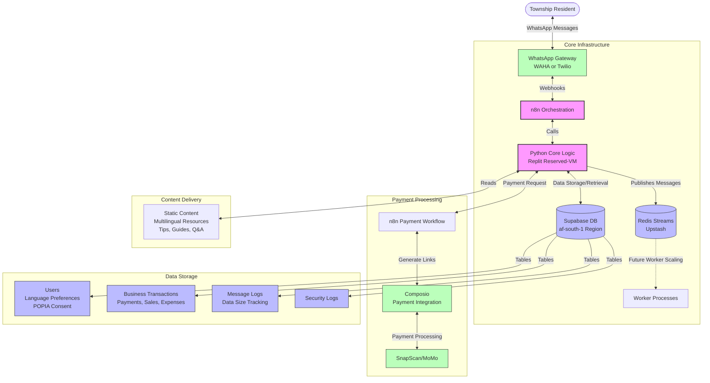

# Township Connect - Architecture Diagram

The following diagram illustrates the technical architecture and message flow of the Township Connect WhatsApp Assistant system.

## Message Flow

1. **User Interaction**: Township residents interact with the system via WhatsApp messages
2. **Message Reception**: WhatsApp Gateway (WAHA or Twilio) receives messages and forwards them to n8n via webhooks
3. **Orchestration**: n8n workflows process incoming webhooks and call the Python core logic
4. **Core Processing**: Python application:
   - Identifies users and manages language preferences
   - Handles POPIA compliance
   - Processes commands for business tools, information access, and learning content
   - Stores data in Supabase
   - Publishes to Redis Streams for future worker scaling
5. **Payment Processing**: For payment-related commands, Python calls n8n payment workflows, which interact with Composio to generate payment links for SnapScan/MoMo
6. **Response Delivery**: Responses flow back through Python → n8n → WhatsApp Gateway → User

## Key Components

- **WhatsApp Gateway**: WAHA (WhatsApp HTTP API) or Twilio
- **n8n**: Workflow automation platform for orchestrating message handling and payment processing
- **Python Core Logic**: Hosted on Replit Reserved-VM, handles business logic and command processing
- **Supabase**: PostgreSQL database hosted in the af-south-1 region (South Africa) for data residency compliance
- **Redis Streams (Upstash)**: Message queue for future worker scaling
- **Composio**: Integration platform for payment processing via SnapScan and MoMo

This architecture ensures data-light interactions (≤5 KB/interaction), multilingual support (English, isiXhosa, Afrikaans), and POPIA compliance while providing business tools, information access, and learning resources to township residents.