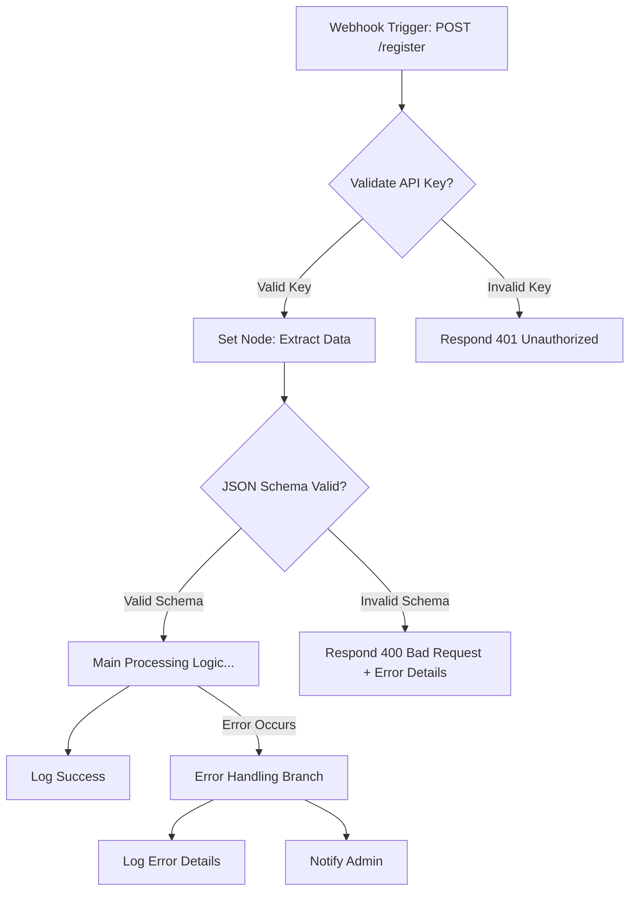

# Primary Findings: n8n Setup and Python Integration - Part 2

This document continues the primary findings, focusing on n8n Cloud options and comparing them with self-hosting, as well as n8n Webhook configuration.

## 3. n8n Cloud (Addresses Q1.3 and Q1.4)

n8n Cloud offers a managed service for running n8n workflows without the need for users to manage the underlying infrastructure.

### 3.1. n8n Cloud Features
*   **Managed Service:** n8n handles updates, backups, and scaling, reducing the operational burden on users [S3-4].
*   **Execution-Based Pricing:** Users are primarily charged based on the number of successful workflow executions. Complex workflows with multiple steps are charged as a single execution [S3-2].
*   **Team Collaboration Features:**
    *   Starter Plan: Allows 1 editor and up to 5 active workflows [S3-1].
    *   Pro Plan: Supports 2 editors, 100 active workflows, and includes priority email support [S3-5].
    *   Granular editor permissions and shared workflow libraries are available [S3-5].
*   **Enterprise-Grade Security (Enterprise Plan):** Includes features like SAML/SSO, audit logs, and dedicated infrastructure [S3-5].

### 3.2. n8n Cloud Limitations
*   **Execution Limits:** Plans come with a specific number of included executions. Overages are charged per 1,000 additional executions (e.g., €8 per 1k overages) [S3-4].
*   **Active Workflow Constraints:** The number of active workflows is limited based on the chosen plan (e.g., 5 on Starter) [S3-1].
*   **Support Tiers:** Priority support is typically available on higher-tier plans (Pro and Enterprise) [S3-5].

### 3.3. n8n Cloud Pricing Tiers (as of search date)
| Plan         | Monthly Cost (EUR) | Included Executions | Active Workflows | Editors | Key Features                                   |
|--------------|--------------------|---------------------|------------------|---------|------------------------------------------------|
| **Starter**  | €20                | 2,500               | 5                | 1       | Basic features, 1 editor                       |
| **Pro**      | €50                | 10,000              | 100              | 2       | More executions, more workflows, priority support |
| **Enterprise**| Custom             | Unlimited           | Unlimited        | Custom  | SAML/SSO, audit logs, dedicated infrastructure |

*Note: Annual billing is typically required for Starter and Pro plans [S3-1, S3-5]. Prices might vary by region or be displayed in other currencies (e.g., $24/month for Starter mentioned in one source [S3-1], but €20 seems more consistent across other sources for European context).*
*   **Startup Plan:** A "Startup Plan" was also mentioned at €400/month offering unlimited executions, aimed at scaling startups [S3-2].

### 3.4. Comparison: n8n Cloud vs. Self-Hosting

**Pros of n8n Cloud:**
*   **Ease of Use & Zero Maintenance:** No server setup, automatic updates, backups, and infrastructure scaling are handled by n8n [S3-4].
*   **Predictable Costs (for included usage):** Fixed monthly fees for the plan's allocated resources, though overages can add variability [S3-2].
*   **Built-in Collaboration Tools:** Features designed for team use are readily available [S3-5].
*   **Good for Non-Technical Teams:** Suitable for users or teams without dedicated DevOps or server management expertise [S3-2].

**Cons of n8n Cloud:**
*   **Recurring Costs:** Subscription fees can be higher than minimal self-hosting server costs, especially as usage scales [S3-4].
*   **Execution/Workflow Limits:** Constraints on the number of executions and active workflows based on the plan.
*   **Less Control:** No ability to install custom plugins or have deep system-level access compared to self-hosting [S3-4 implied].
*   **Data Residency/Compliance:** Data passes through n8n's cloud infrastructure, which might be a concern for organizations with strict data sovereignty or compliance requirements (though n8n likely offers regional hosting options) [S3-5 implied].

**Pros of Self-Hosting (Community Edition):**
*   **Potentially Lower Cost:** The n8n Community Edition software is free. Primary costs are for the server/VPS (estimated ~€5-10/month for a basic VPS) [S3-2].
*   **Full Control and Customization:** Ability to install custom plugins, modify configurations, and have unrestricted API access. Can be run offline [S3-4].
*   **Unlimited Executions/Workflows (theoretically):** No artificial limits imposed by n8n, constrained only by server resources.
*   **Data Sovereignty:** Full control over where data is stored and processed, which can be crucial for compliance [S3-5].

**Cons of Self-Hosting:**
*   **Maintenance Overhead:** User is responsible for setup, updates, security, backups, and scaling the server. Requires technical expertise [S3-2, S3-4].
*   **Potential for Unexpected Issues:** Downtime, security vulnerabilities, or data loss can occur if not managed properly.
*   **No Official Support (for Community Edition):** Relies on community forums for help.
*   **Resource Management:** User must provision and manage server resources (CPU, RAM, disk).

### 3.5. Key Considerations When Choosing:
*   **Team Size and Technical Expertise:** Teams lacking DevOps resources may prefer the Cloud. Technically proficient users/teams might opt for self-hosting [S3-2].
*   **Budget:** Cloud costs scale with usage (e.g., ~€0.008/execution for Starter overages). Self-hosting has fixed infrastructure costs but potential hidden costs in terms of management time [S3-4].
*   **Workflow Volume and Complexity:** High-volume or very complex workflows might become expensive on usage-based Cloud plans, making self-hosting more economical if server resources can handle the load [S3-2].
*   **Compliance and Security Needs:** Organizations with strict data control or compliance requirements (e.g., regulated industries) might prefer self-hosting to maintain full data sovereignty [S3-5].
*   **Need for Customization:** If custom n8n nodes or deep integrations are required, self-hosting offers more flexibility.

### 3.6. Note on Alternatives
Other automation platforms like Zapier (from $19.99/month), Make (from $9/month), and Tray.io (custom pricing for enterprise) exist, each with different UIs, feature sets, and pricing models [S3-2, S3-3]. The choice depends on specific needs beyond just n8n's capabilities.

---
**Sources (Section 3):**
*   [S3-1] Information on Starter plan pricing ($24/month, 2.5k executions, 5 active workflows, 1 editor) and annual billing.
*   [S3-2] Information on execution-based pricing (no charge for steps), self-hosting costs (€5-10/month VPS), Cloud for non-DevOps teams, Startup Plan (€400/month), self-hosting for complex/data-heavy workflows, and mentions of Zapier/Tray.io.
*   [S3-3] Mention of Make as an alternative.
*   [S3-4] Information on n8n Cloud pricing (€20/month for 2.5k exec, €8/1k overage), zero maintenance, custom plugins/offline use for self-hosting, Cloud for seasonal workloads, Cloud costs scaling with usage.
*   [S3-5] Information on Pro plan (€50/month, 10k exec, 100 active workflows, 2 editors, priority support), Enterprise features (SAML/SSO, audit logs), collaboration, self-hosting for compliance.
(Note: Source numbering corresponds to the references provided in the Perplexity search result for the n8n Cloud query.)

---

## 4. n8n Workflow Creation for External Triggers (Webhooks) (Addresses Q2.1, Q2.2)

This section covers configuring n8n's Webhook node to securely receive POST requests with JSON payloads and best practices for structuring the triggered workflows.

### 4.1. Webhook Node Setup
*   **HTTP Method:** In the Webhook node parameters, set the "HTTP Method" to `POST` to accept POST requests [S4-1].
*   **Path:** Configure an explicit "Path" for the webhook (e.g., `/my-service/new-data`). Avoid relying on randomly generated paths for production webhooks to ensure stability and better organization [S4-1, S4-4].
*   **Response Mode:**
    *   **Respond Immediately ("Respond with Webhook"):** Enable this option to send an immediate HTTP 200 OK acknowledgement to the caller as soon as the webhook is triggered. This is useful for systems that expect a quick response and prevents timeouts if the workflow takes longer to execute [S4-1].
    *   **Respond Later (using "Respond to Webhook" node):** If a custom response needs to be sent back after some processing, disable immediate response and use a "Respond to Webhook" node later in the workflow.
*   **Payload Size:** The default maximum payload size for a webhook is 16MB. If larger payloads are expected, the `N8N_PAYLOAD_SIZE_MAX` environment variable can be set for self-hosted instances [S4-1].
*   **Test vs. Production URLs:** The Webhook node provides both "Test" and "Production" URLs.
    *   **Test URL:** Used during workflow development. Executing this URL allows viewing the received data directly in the n8n editor. The workflow needs to be manually executed for each test call [S4-1, S4-3].
    *   **Production URL:** Used when the workflow is active and deployed. Data from production calls is not directly visible in the editor UI but can be seen in the "Executions" tab [S4-1]. Workflows with production URLs execute automatically when triggered [S4-1].

### 4.2. Security Implementation for Webhooks
*   **HTTPS:** Crucial for all production webhooks. For self-hosted n8n, this is typically achieved by placing n8n behind a reverse proxy (e.g., NGINX, Caddy, Traefik) that handles SSL/TLS termination [S4-4].
*   **Authentication:**
    *   **API Key/Token:** Include a secure, hard-to-guess token or API key in the request headers (e.g., `X-API-Key: your_secure_token`) or as a query parameter (less secure). The n8n workflow should then validate this token using an "IF" node or a "Function" node.
    *   **Basic Authentication:** The Webhook node has built-in support for HTTP Basic Authentication.
*   **IP Whitelisting:** If requests are expected only from specific IP addresses, configure this at the reverse proxy or firewall level.
*   **Obscure Paths (if not using token auth):** While not a replacement for proper authentication, using non-obvious paths can add a minor layer of obscurity.
*   **Rate Limiting:** Implement rate limiting at the reverse proxy level to prevent abuse.
*   **Validate `X-Forwarded-For` Header:** If n8n is behind a reverse proxy, ensure you validate the `X-Forwarded-For` header to get the true client IP if needed for logging or security, but be aware this header can be spoofed if not handled correctly by the proxy chain [S4-4].

### 4.3. Structuring Webhook-Triggered Workflows

#### 4.3.1. Initial Data Handling
*   **Set Node:** Immediately after the Webhook trigger, use a "Set" node to extract and map relevant parts of the incoming JSON payload (usually found in `{{ $json.body }}` or `{{ $json.query }}` for GET, `{{ $json.headers }}`) to more easily accessible top-level variables. Example: `customer_id = {{ $json.body.customerId }}`.

#### 4.3.2. Data Validation
*   **IF Node:** Use "IF" nodes to check for the presence and basic format of required fields.
    *   Example Condition: `{{ !$json.body.email || !$json.body.userId }}` -> If true, route to an error handling branch.
*   **JSON Schema Validation (Function Node or Community Node):** For more complex validation, use a "Function" node to implement JSON schema validation against the incoming `{{ $json.body }}`.
    ```javascript
    // Example in a Function node (requires a JSON schema library or manual checks)
    const Ajv = require('ajv'); // Assuming Ajv library is available if self-hosting with custom setup
    const ajv = new Ajv();
    const schema = {
      type: "object",
      properties: {
        userId: { type: "number" },
        email: { type: "string", format: "email" }
      },
      required: ["userId", "email"]
    };
    const validate = ajv.compile(schema);
    const valid = validate(items[0].json.body);
    if (!valid) {
      items[0].json.errorDetails = validate.errors;
      items[0].json.isValid = false;
      // Consider throwing an error here to be caught by an Error Trigger node
      // throw new Error("Invalid payload: " + ajv.errorsText(validate.errors));
    } else {
      items[0].json.isValid = true;
    }
    return items;
    ```
    Alternatively, look for community nodes that might offer JSON schema validation.
*   **Respond on Validation Failure:** If validation fails, use a "Respond to Webhook" node (if not using immediate response) to send an appropriate HTTP error (e.g., 400 Bad Request) with error details.

#### 4.3.3. Error Handling
*   **Error Trigger Node:** Attach an "Error Trigger" node to the main workflow path. This node will activate if any node in the main path fails (throws an error). This allows for centralized error logging or notification.
*   **"Continue on Fail" Setting:** For non-critical steps, you can configure individual nodes to "Continue on Fail" in their settings, allowing the workflow to proceed even if that specific node encounters an issue. Use this cautiously.
*   **Specific Error Branches:** Use "IF" nodes after potentially failing operations to check for specific error conditions (e.g., an API call returning an error status code) and route to dedicated error handling logic.

#### 4.3.4. Logging
*   **Write to Log (Community Node) / Function Node:** Throughout the workflow, especially at key decision points, successful operations, and error branches, log relevant information.
    *   A "Write to Log" community node might be available.
    *   Alternatively, use a "Function" node with `console.log()` for basic logging (visible in n8n's execution log or server logs for self-hosted).
    *   Example Log Entry: `{{ $now }} | Workflow: UserRegistration | Status: SUCCESS | UserID: {{ $json.body.userId }}`
    *   In an error branch: `{{ $now }} | Workflow: UserRegistration | Status: FAILED | Error: {{ $json.errorMessage }} | Payload: {{ JSON.stringify($json.body) }}`

### 4.4. Example Workflow Structure (Conceptual)



### 4.5. Alternatives for Webhook Management
*   **Hookdeck:** A third-party service that can act as a proxy for webhooks. It provides features like reliability (retries, queuing), monitoring, and easier management for critical webhooks [S4-5]. This adds a layer between the caller and n8n.
*   **API Gateway:** For complex scenarios, especially in a microservices architecture, an API Gateway (e.g., AWS API Gateway, Kong) can manage incoming requests, authentication, rate limiting, and then forward valid requests to the n8n webhook.

By following these steps and considerations, n8n workflows triggered by webhooks can be made more secure, robust, and maintainable.

---
**Sources (Section 4):**
*   [S4-1] Information on Webhook node parameters (HTTP method, path, payload size, respond with webhook, test/production URLs, payload display).
*   [S4-3] Mention of manual trigger for test URL and parameter passing.
*   [S4-4] Discussion on reverse proxies for SSL and path rewriting, and validating X-Forwarded-For.
*   [S4-5] Introduction to Hookdeck for webhook management, reliability, and enterprise use.
(Note: Source numbering corresponds to the references provided in the Perplexity search result for the Webhook configuration query.)